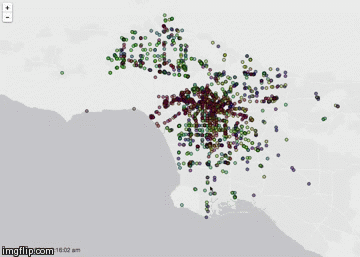

Metrobeat
=============

View real-time LA Metro and Bus positioning, and replay a day's worth of activity. Online at: metrobeat.herokuapp.com




## Replay Design notes

Raw "moments" from the [real-time API|http://developer.metro.net/introduction/realtime-api-overview/]  look like:
```json
{
        "_id" : ObjectId("5392386c75148d02009828e0"),
        "seconds_since_report" : 5,
        "run_id" : "240_126_0",
        "longitude" : -118.535957,
        "heading" : 180,
        "route_id" : "240",
        "predictable" : true,
        "latitude" : 34.208046,
        "id" : "8297",
        "snapshot_ts" : 1402091626891,
        "geo" : [
                -118.535957,
                34.208046
        ]
}
```

In a given day, there are almost 400k moments in the system.

```javascript
 db.moments.find({ 'snapshot_ts' : { $gt: 1402531200000, $lt: 1402617599999 }}).count()
394507
```

To get the documents we want, and squish them down a bit, we can make use of the aggregation pipeline, and node streams to broadcast the data to the client. Ex:

```javascript
var cursor = mongohelper.aggregateCursor(
   'moments',
   [
     { $match: { 'snapshot_ts' : { $gt: start, $lt: end }} },
     { $sort: {'snapshot_ts': 1}},
     { $project: {'v': "$id", 'r': "$route_id", 'g': "$geo", 't' : "$snapshot_ts", '_id': 0}}
   ],
   {
    'allowDiskUse': true,
    cursor: { batchSize: 1000 }
 });

var counter = 0;

var batch = [];
var batch_size = 1000;

cursor.on('data', function(data) {
  data.r = parseInt(data.r);
  batch.push(data);
  if (batch.length >= batch_size) {
    socket.emit('data', batch);
    batch.length = 0;
  }
  counter++;
});

cursor.on('end', function() {
  socket.emit('data', batch);
  socket.emit('done', true);
});
```


### TODO

GIS data: http://developer.metro.net/introduction/gis-data/
GTFS feeds: http://developer.metro.net/introduction/gtfs-data/

